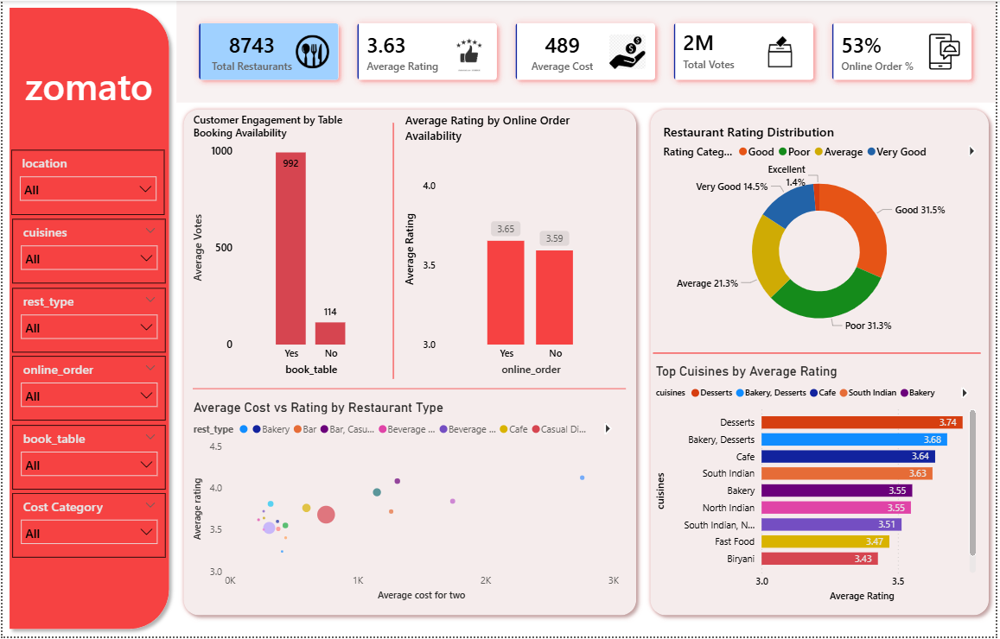

# Zomato Restaurant Analytics Dashboard (Power BI)

## Project Overview
This project is an interactive Power BI dashboard built to explore restaurant data from
Zomato. The goal was to understand how factors like pricing, cuisine type, online ordering,
and table booking relate to restaurant ratings and customer engagement.

The dashboard is designed to be simple, visual, and easy to explore using filters.

## Key Metrics Tracked
- Total number of restaurants
- Average restaurant rating
- Average cost for two people
- Total customer votes
- Percentage of restaurants offering online ordering

## Key Insights
- Restaurants that offer online ordering tend to have slightly higher average ratings
- Table booking availability is linked with much higher customer engagement (votes)
- Higher-priced restaurants do not always receive better ratings
- Most restaurants fall into the Average to Good rating range, showing high competition

## Tools & Skills Used
- Power BI
- DAX (calculated columns and measures)
- Data modeling
- Data visualization and storytelling

## Notes
This dashboard is based on Zomato-listed restaurant data and reflects platform-level
ratings and engagement. It does not represent actual revenue or sales performance.
